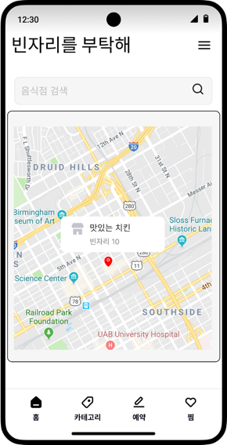
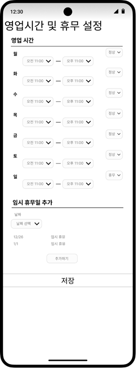

# 빈자리를 부탁해
내 주변 음식점의 빈자리를 확인할 수 있는 어플리케이션
 

## 서비스 개발 동기
- 점심시간 학교 주변 음식점의 혼잡으로 시간을 허비한 경험을 바탕으로 50명의 학생을 대상으로 한 설문조사에서 90%가 같은 경험을 했다고 응답했습니다.
- 캡스톤 디자인 프로젝트를 통해 불편을 해결할 수 있는 빈자리를 확인할 수 있는 앱을 개발하기로 결정했습니다.

 

## 기능 소개

- **위치 기반 음식점 추천** - 내 위치를 기반으로 지도에 마커로 표시해 주변 음식점들의 위치 및 빈자리 수를 알려주는 시스템입니다.
- **자리 배치 확인** - 빈자리 수 뿐 아니라 해당 매장 정보에서는 자리의 배치 및 원하는 자리가 비어있는지 확인할 수 있습니다.
- **음식점 검색 및 추천** - 원하는 음식점을 검색할 수 있으며, 실시간 검색 순위를 제공하여 사용자에게 음식점을 추천합니다.

 

## 서비스 UI
 
 

 

